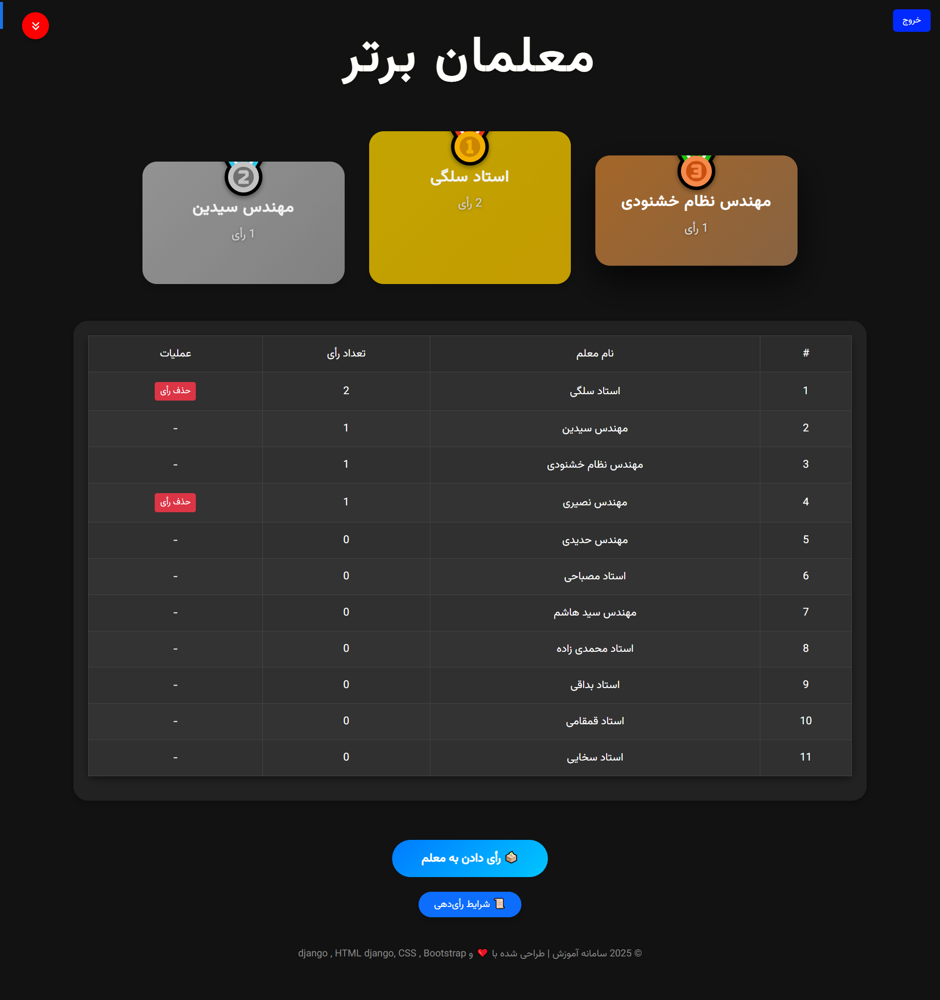
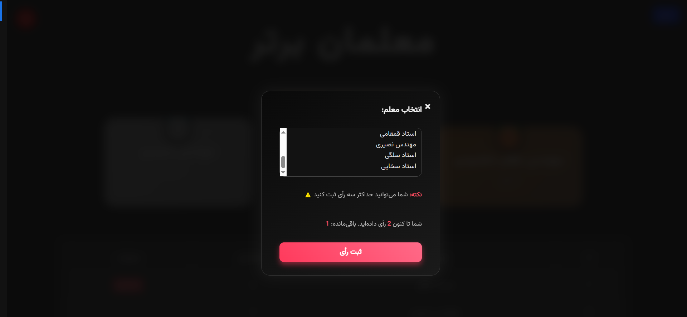

<p align="center">
  
  
</p>

# 🎓✨ Teacher Voting System ✨🎓

> **A fully Persian, secure, and modern platform for choosing the best teachers!**  
> Built with ❤️ Python, Django, HTML, CSS, Bootstrap, and powered by MySQL.

---

## 🚀 Project Overview

Ready to select the best teachers with your vote?  
In **Teacher Voting System**, easily register, verify your email with a security code, and confidently vote for **up to 3 different teachers** — no duplicate votes allowed!

🌟 Here, fairness and transparency come first!

---

## 🔥 Key Features

- 🛡️ **Secure and simple registration** with two-step email verification  
- ✅ Vote limit capped at 3 different teachers  
- 🚫 Prevent duplicate votes for the same teacher  
- 📱 Fully responsive, beautiful, and user-friendly Persian interface  
- 🔐 Strong security implementation to protect your data and votes  
- ⚡ Smooth, fast, and modern UX with appealing animations  

---

## 🛠 Technologies Used

| Technology      | Version       | Description                 |
|-----------------|---------------|-----------------------------|
| 🐍 Python       | 3.x           | Core programming language   |
| 🌐 Django       | 5.2.1         | Backend framework           |
| 💻 HTML5 & CSS3 | -             | Frontend structure & style  |
| ⚡ Bootstrap 5   | -             | Responsive UI framework     |
| 🗄️ MySQL        | -             | Powerful database           |

---

## 🧑‍💻 Installation & Setup (Step by Step)

1. Clone the repository:  
```bash
git clone https://your-repo-url.git
cd your-project-folder


python -m venv venv
source venv/bin/activate  # On Windows: venv\Scripts\activate

pip install -r requirements.txt

DATABASES = {
    'default': {
        'ENGINE': 'django.db.backends.mysql',
        'NAME': 'teacher_voting_db',
        'USER': 'your_mysql_user',
        'PASSWORD': 'your_mysql_password',
        'HOST': 'localhost',
        'PORT': '3306',
    }
}

python manage.py migrate

python manage.py runserver

python manage.py runserver

http://127.0.0.1:8000/
```
## 🔐 Important Notes

- Please register with a valid email that has two-step verification enabled.
- Your votes are limited to 3 different teachers and duplicates are not allowed.
- The system is designed to ensure fairness and security throughout the voting process.

---

## 🎉 Join Us!

Become part of this community and help select the best teachers by casting your votes responsibly. Share with friends and make a real difference!

---

## 📞 Contact

For questions or support, please contact the project maintainer.

Enjoy voting!  
— The Teacher Voting System Team

---

*If you want, I can also generate a `requirements.txt` file or help with setup instructions for email verification or deployment. Just let me know!*

